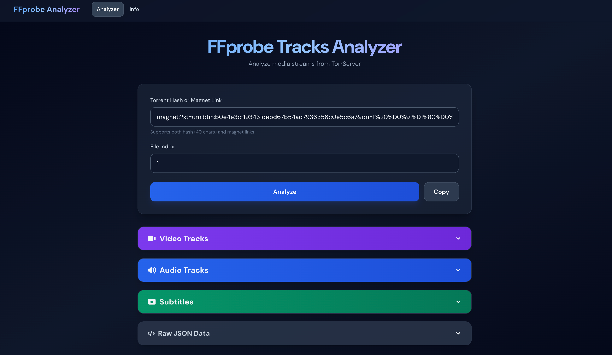

# Lampa Torrent Tracks

HTTP API и веб-интерфейс для получения метаданных медиа (FFprobe) через TorrServer. Предназначен для интеграции с [Lampa](https://github.com/yumata/lampa).

- **REST API** — эндпоинты `/api/ffprobe` и `/api/ffprobe-auto` (автодобавление торрента)
- **Веб-интерфейс** — страницы анализа треков, инфо и WebSocket-демо
- **Docker** — образ на Node.js 24 Alpine, multi-arch сборка через `scripts/build-docker.sh`
- **Без внешних зависимостей** — только Node.js и доступ к TorrServer



---

## Структура проекта

```bash
├── public/                 # Статика (отдаётся по /)
│   ├── index.html          # Анализатор треков (hash/magnet → video/audio/subs)
│   ├── info.html           # Информация о проекте и возможностях
│   ├── websocket.html      # Демо WebSocket (опционально)
│   ├── app.js              # Логика фронтенда анализатора
│   └── favicon.png         # Иконка сайта
├── src/
│   └── server-nodejs.js    # HTTP-сервер: API + раздача public/
├── scripts/
│   └── build-docker.sh     # Сборка Docker (amd64/arm64/armv7)
├── package.json
├── Dockerfile
└── docker-compose.yml
```

- **Порт:** один порт (по умолчанию `3000`) — и API, и статика.
- **Запуск:** `npm start` или `node src/server-nodejs.js` из корня репозитория.

---

## Требования

- **Node.js** ≥ 18
- **npm** ≥ 8
- Доступ к **TorrServer** (локально или по URL)

---

## Быстрый старт

### Локально

```bash
git clone <repo>
cd lampa-torrents-tracks
npm install
npm start
```

Сервер: `http://localhost:3000`  
В браузере: главная — анализатор, `/info.html` — инфо, `/websocket.html` — WebSocket.

### Docker

```bash
# Сборка и запуск (образ из docker-compose)
docker-compose up -d

# Локальная сборка образа
docker build -t lampa-torrents-tracks .

docker run -d --name lampa-torrents-tracks -p 3000:3000 \
  -e TORRSERVER_URL=http://host.docker.internal:8090 \
  -e TORRSERVER_USERNAME=user \
  -e TORRSERVER_PASSWORD=pass \
  --add-host host.docker.internal:host-gateway \
  lampa-torrents-tracks
```

### Multi-arch сборка (скрипт)

```bash
./scripts/build-docker.sh --help

# Примеры
./scripts/build-docker.sh
./scripts/build-docker.sh --platforms linux/amd64,linux/arm64
./scripts/build-docker.sh --registry ghcr.io/username --push
```

---

## Конфигурация (переменные окружения)

| Переменная                          | По умолчанию            | Описание                                         |
| ----------------------------------- | ----------------------- | ------------------------------------------------ |
| `HTTP_PORT`                         | `3000`                  | Порт HTTP-сервера                                |
| `TORRSERVER_URL`                    | `http://localhost:8090` | URL TorrServer                                   |
| `TORRSERVER_USERNAME`               | —                       | Логин TorrServer (опционально)                   |
| `TORRSERVER_PASSWORD`               | —                       | Пароль TorrServer (опционально)                  |
| `TORRSERVER_METADATA_MAX_ATTEMPTS`  | `60`                    | Число попыток ожидания метаданных (ffprobe-auto) |
| `TORRSERVER_METADATA_ATTEMPT_DELAY` | `1000`                  | Задержка между попытками, мс                     |
| `TORRSERVER_REQUEST_TIMEOUT_MS`     | `60000`                 | Таймаут запроса к TorrServer, мс                 |
| `TORRSERVER_RESPONSE_MAX_BYTES`     | `5242880`               | Макс. размер ответа TorrServer, байт (5 MB)      |

В `docker-compose.yml` можно задать свои значения в секции `environment`.

---

## API

### GET /health

Проверка работы сервера.

**Ответ:** `200 OK`, JSON: `{ "status": "ok", "timestamp": "..." }`

---

### GET /api/ffprobe

FFprobe по уже добавленному в TorrServer торренту.

**Параметры:**

| Параметр | Обязательный | Описание                                |
| -------- | ------------ | --------------------------------------- |
| `hash`   | да           | Хеш торрента (40 hex) или magnet-ссылка |
| `index`  | нет          | Номер файла в раздаче, по умолчанию `1` |

**Пример:**

```bash
curl "http://localhost:3000/api/ffprobe?hash=YOUR_40CHAR_HASH&index=1"
```

**Ответ:** JSON с полем `streams` (массив потоков: video, audio, subtitle). При отсутствии торрента — `404` и `{ "error": "..." }`.

---

### GET /api/ffprobe-auto

Рекомендуемый эндпоинт для интеграций. Проверяет наличие торрента в TorrServer; если его нет — добавляет, ждёт метаданные, затем возвращает FFprobe.

**Параметры:**

| Параметр | Обязательный | Описание                         |
| -------- | ------------ | -------------------------------- |
| `hash`   | да           | Хеш (40 hex) или magnet          |
| `index`  | нет          | Номер файла, по умолчанию `1`    |
| `title`  | нет          | Название при добавлении торрента |

**Примеры:**

```bash
curl "http://localhost:3000/api/ffprobe-auto?hash=YOUR_HASH&index=1"
curl "http://localhost:3000/api/ffprobe-auto?hash=YOUR_HASH&index=1&title=My%20Video"
```

**Ответ:** как у `/api/ffprobe`. При ошибке добавления или таймауте — соответствующий HTTP-код и JSON `{ "error": "..." }` (в т.ч. `408` при таймауте ожидания метаданных).

---

## Веб-интерфейс

- **`/`** — анализатор: ввод hash/magnet и номера файла, кнопки «Analyze» и «Copy», вывод видео/аудио/субтитров и сырой JSON.
- **`/info.html`** — описание возможностей, архитектуры и быстрого старта.
- **`/websocket.html`** — демо WebSocket (если используется отдельный WebSocket-сервис).

Статика (HTML, JS, favicon) лежит в `public/`, сервер отдаёт её без изменения URL.

---

## Интеграция с Lampa

Плагин для Lampa может вызывать `/api/ffprobe-auto` по вашему домену:

```text
https://your-domain.com/api/ffprobe-auto?hash={hash}&index={index}&title={title}
```

Разверните этот сервер, настройте HTTPS (например, cloudflared) и укажите в плагине ваш `api_host`.

---

## Разработка

```bash
npm install
npm run dev   # nodemon src/server-nodejs.js
```

Сервер запускается на `http://localhost:3000`.

---

## Устранение неполадок

- **Контейнер не стартует** — проверьте логи: `docker-compose logs lampa-torrents-tracks`, доступность порта: `lsof -i :3000`.
- **Ошибки API** — убедитесь, что TorrServer доступен (`curl $TORRSERVER_URL`), проверьте переменные окружения в контейнере.
- **408 Timeout** — метаданные торрента не успели подгрузиться; можно увеличить `TORRSERVER_METADATA_MAX_ATTEMPTS` в `src/server-nodejs.js` или через переменные окружения.
- **Пустой FFprobe** — проверьте, что индекс файла корректен и файл — медиа (MKV, MP4 и т.д.).

---

## Лицензия

[MIT](LICENSE)

---

## Связанные проекты

- [Lampa](https://github.com/yumata/lampa) — медиаплеер
- [TorrServer](https://github.com/YouROK/TorrServer) — FFprobe API и автодобавление торрентов
