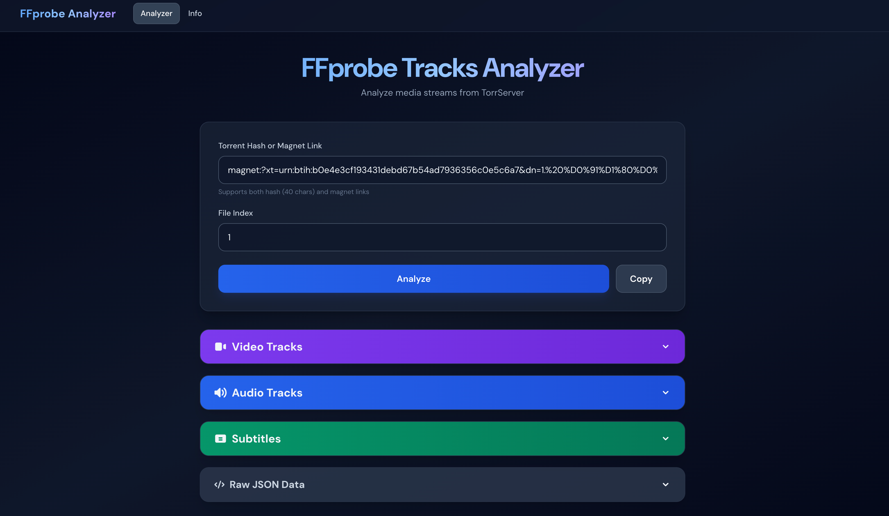

# Lampa Torrent Tracks

HTTP API и веб-интерфейс для получения метаданных медиа (FFprobe) через TorrServer. Предназначен для интеграции с [Lampa](https://github.com/yumata/lampa).

- **REST API** — версионированные эндпоинты `/api/v1/tracks` и `/api/v1/tracks/auto` (автодобавление торрента)
- **Кэширование** — in-memory LRU-кэш результатов FFprobe с TTL
- **Дедупликация** — параллельные запросы на один hash/index выполняются один раз, результат раздаётся всем
- **Retry** — автоматический повтор FFprobe при транзиентных 5xx-ошибках TorrServer (3 попытки, backoff)
- **Rate limiting** — защита API от flood-запросов: скользящее окно по IP (по умолчанию 120 req/мин)
- **Обработка ошибок** — централизованная система с кодами и структурированным логированием
- **Логирование** — `ERROR`/`WARN` в `stderr`, `INFO`/`DEBUG` в `stdout` (удобно для Docker/systemd)
- **Веб-интерфейс** — анализатор треков с таймером и понятными сообщениями об ошибках
- **Docker** — образ на Node.js 24 Alpine, multi-arch сборка через `scripts/build-docker.sh`
- **Без внешних зависимостей** — только Node.js и доступ к TorrServer



---

## AI Документация

[](https://deepwiki.com/pavelpikta/lampa-torrents-tracks)

## Структура проекта

```bash
├── public/                 # Статика (отдаётся по /)
│   ├── index.html          # Анализатор треков (hash/magnet → video/audio/subs)
│   ├── info.html           # Информация о проекте и возможностях
│   ├── app.js              # Логика фронтенда анализатора
│   └── favicon.png         # Иконка сайта
├── src/
│   ├── server-nodejs.js    # Точка входа: HTTP-сервер, graceful shutdown
│   ├── config.js           # Конфигурация из переменных окружения
│   ├── routes.js           # Роутер: CORS, rate limiting, API, статика
│   ├── handlers/
│   │   └── ffprobe.js      # Обработка ответа FFprobe
│   └── lib/
│       ├── torrserver.js   # HTTP-клиент TorrServer (retry, polling)
│       ├── cache.js        # In-memory LRU-кэш с TTL
│       ├── request-deduplication.js  # Дедупликация параллельных запросов
│       ├── rate-limiter.js # Скользящее окно rate limit по IP
│       ├── retry.js        # Exponential backoff retry
│       ├── errors.js       # AppError, ERROR_CODES, handleError
│       ├── logger.js       # Структурированный логгер (stderr/stdout)
│       ├── static.js       # Раздача статики с защитой от path traversal
│       └── utils.js        # generateRequestId
├── scripts/
│   └── build-docker.sh     # Сборка Docker (amd64/arm64/armv7)
├── example/
│   └── tracks.js           # Пример плагина для Lampa
├── package.json
├── Dockerfile
└── docker-compose.yml
```

- **Порт:** один порт (по умолчанию `3000`) — и API, и статика.
- **Запуск:** `npm start` или `node src/server-nodejs.js` из корня репозитория.

---

## Требования

- **Node.js** ≥ 18
- **npm** ≥ 8
- Доступ к **TorrServer** (локально или по URL)

---

## Быстрый старт

### Локально

```bash
git clone <repo>
cd lampa-torrents-tracks
npm install
npm start
```

Сервер: `http://localhost:3000`  
В браузере: главная — анализатор, `/info.html` — информация о проекте.

### Docker

```bash
# Готовый образ из docker-compose
docker-compose up -d

# Локальная сборка образа
docker build -t lampa-torrents-tracks .

docker run -d --name lampa-torrents-tracks -p 3000:3000 \
  -e TORRSERVER_URL=http://host.docker.internal:8090 \
  -e TORRSERVER_USERNAME=user \
  -e TORRSERVER_PASSWORD=pass \
  --add-host host.docker.internal:host-gateway \
  lampa-torrents-tracks
```

### Multi-arch сборка (скрипт)

```bash
./scripts/build-docker.sh --help

# Примеры
./scripts/build-docker.sh
./scripts/build-docker.sh --platforms linux/amd64,linux/arm64
./scripts/build-docker.sh --registry ghcr.io/username --push
```

---

## Конфигурация (переменные окружения)

| Переменная                          | По умолчанию            | Описание                                              |
| ----------------------------------- | ----------------------- | ----------------------------------------------------- |
| `HTTP_PORT`                         | `3000`                  | Порт HTTP-сервера                                     |
| `TORRSERVER_URL`                    | `http://localhost:8090` | URL TorrServer                                        |
| `TORRSERVER_USERNAME`               | —                       | Логин TorrServer (опционально)                        |
| `TORRSERVER_PASSWORD`               | —                       | Пароль TorrServer (опционально)                       |
| `TORRSERVER_METADATA_MAX_ATTEMPTS`  | `60`                    | Число попыток ожидания метаданных (tracks/auto)       |
| `TORRSERVER_METADATA_ATTEMPT_DELAY` | `1000`                  | Задержка между попытками, мс                          |
| `TORRSERVER_REQUEST_TIMEOUT_MS`     | `60000`                 | Таймаут запроса к TorrServer, мс                      |
| `TORRSERVER_RESPONSE_MAX_BYTES`     | `5242880`               | Макс. размер ответа TorrServer, байт (5 MB)           |
| `CACHE_MAX_SIZE`                    | `1000`                  | Максимальное количество записей в кэше                |
| `CACHE_TTL_MS`                      | `3600000`               | Время жизни кэша, мс (1 час)                          |
| `CACHE_CLEANUP_INTERVAL_MS`         | `600000`                | Интервал очистки кэша, мс (10 минут)                  |
| `RATE_LIMIT_MAX_REQUESTS`           | `120`                   | Макс. запросов с одного IP за окно                    |
| `RATE_LIMIT_WINDOW_MS`              | `60000`                 | Размер окна rate limit, мс (1 минута)                 |
| `LOG_LEVEL`                         | `INFO`                  | Уровень логирования: `ERROR`, `WARN`, `INFO`, `DEBUG` |

> **Логирование:** `ERROR` и `WARN` пишутся в `stderr`, `INFO` и `DEBUG` — в `stdout`. Удобно для Docker log drivers и систем агрегации логов (Loki, CloudWatch и др.).

Все переменные можно задать в `.env` (локально) или в секции `environment` файла `docker-compose.yml`.

---

## API

### GET /health

Проверка работы сервера и доступности TorrServer.

**Ответы:**

- `200 OK` — сервер и TorrServer работают нормально.
- `503 Service Unavailable` — HTTP-сервер работает, но TorrServer недоступен.

```json
{
  "status": "ok",
  "timestamp": "2026-03-04T10:00:00.000Z",
  "torrserver": { "reachable": true },
  "api": {
    "version": "1.0.0",
    "endpoints": { "v1": { "tracks": "/api/v1/tracks", "tracksAuto": "/api/v1/tracks/auto" } }
  },
  "cache": { "size": 42, "active": 40, "expired": 2, "maxSize": 1000 },
  "deduplication": { "pendingRequests": 0 }
}
```

> **Docker healthcheck** принимает и `200`, и `503` как «живой» контейнер — это предотвращает рестарт при временной недоступности TorrServer.

---

### GET /api/v1/tracks

FFprobe по уже добавленному в TorrServer торренту.

**Параметры:**

| Параметр | Обязательный | Описание                                |
| -------- | ------------ | --------------------------------------- |
| `hash`   | да           | Хеш торрента (40 hex) или magnet-ссылка |
| `index`  | нет          | Номер файла в раздаче, по умолчанию `1` |

**Пример:**

```bash
curl "http://localhost:3000/api/v1/tracks?hash=YOUR_40CHAR_HASH&index=1"
```

**Ответ:** JSON с полем `streams` (массив потоков: video, audio, subtitle). Заголовки ответа включают `X-API-Version: v1` и `Content-Length`. При кэшированном результате добавляются `X-Cache: HIT` и `Cache-Control: public, max-age=3600`.

---

### GET /api/v1/tracks/auto

Рекомендуемый эндпоинт для интеграций. Проверяет наличие торрента в TorrServer; если его нет — добавляет, ждёт метаданные, затем возвращает FFprobe. Параллельные запросы с одинаковыми `hash`+`index` дедуплицируются. Запрос к FFprobe повторяется автоматически до 3 раз при транзиентных ошибках TorrServer.

**Параметры:**

| Параметр | Обязательный | Описание                         |
| -------- | ------------ | -------------------------------- |
| `hash`   | да           | Хеш (40 hex) или magnet          |
| `index`  | нет          | Номер файла, по умолчанию `1`    |
| `title`  | нет          | Название при добавлении торрента |

**Примеры:**

```bash
curl "http://localhost:3000/api/v1/tracks/auto?hash=YOUR_HASH&index=1"
curl "http://localhost:3000/api/v1/tracks/auto?hash=YOUR_HASH&index=1&title=My%20Video"
```

**Коды ошибок:**

| HTTP | Код                            | Причина                                           |
| ---- | ------------------------------ | ------------------------------------------------- |
| 400  | `INVALID_HASH`                 | Некорректный hash или magnet                      |
| 400  | `INVALID_INDEX`                | Некорректный индекс файла                         |
| 400  | `TORRENT_ADD_FAILED`           | Не удалось добавить торрент                       |
| 404  | `TORRENT_NOT_FOUND`            | Торрент не найден в TorrServer                    |
| 408  | `METADATA_TIMEOUT`             | Метаданные не подгрузились за отведённое время    |
| 429  | `RATE_LIMIT_EXCEEDED`          | Превышен лимит запросов (заголовок `Retry-After`) |
| 500  | `TORRSERVER_CONNECTION_FAILED` | TorrServer недоступен                             |
| 504  | `TORRSERVER_TIMEOUT`           | Таймаут запроса к TorrServer                      |

---

## Веб-интерфейс

- **`/`** — анализатор: ввод hash/magnet и номера файла, кнопки «Analyze» и «Copy», вывод видео/аудио/субтитров и сырой JSON. Во время ожидания метаданных показывается счётчик секунд; при ошибке `METADATA_TIMEOUT` выводится понятное сообщение с советом повторить запрос.
- **`/info.html`** — описание возможностей, архитектуры и быстрого старта.

Статика (HTML, JS, favicon) лежит в `public/`, сервер отдаёт её по прямым URL.

---

## Интеграция с Lampa

Плагин для Lampa может вызывать `/api/v1/tracks/auto` по вашему домену:

```text
https://your-domain.com/api/v1/tracks/auto?hash={hash}&index={index}&title={title}
```

Разверните этот сервер, настройте HTTPS (например, cloudflared) и укажите в плагине ваш `api_host`.

---

## Разработка

```bash
npm install
npm run dev   # nodemon src/server-nodejs.js
```

Сервер запускается на `http://localhost:3000`.

---

## Устранение неполадок

- **Контейнер не стартует** — проверьте логи: `docker-compose logs lampa-torrents-tracks`, доступность порта: `lsof -i :3000`.
- **`/health` возвращает `503`** — TorrServer недоступен. Проверьте `TORRSERVER_URL` и доступность сети. Контейнер остаётся работоспособным.
- **`408 METADATA_TIMEOUT`** — метаданные торрента не подгрузились за `TORRSERVER_METADATA_MAX_ATTEMPTS × TORRSERVER_METADATA_ATTEMPT_DELAY` мс. Подождите несколько секунд и повторите запрос, либо увеличьте `TORRSERVER_METADATA_MAX_ATTEMPTS`.
- **`429 RATE_LIMIT_EXCEEDED`** — превышен лимит запросов. Уменьшите частоту или увеличьте `RATE_LIMIT_MAX_REQUESTS`.
- **Пустой FFprobe** — проверьте, что индекс файла корректен и файл — медиа (MKV, MP4 и т.д.).
- **Ошибки API** — убедитесь, что TorrServer доступен (`curl $TORRSERVER_URL/echo`), проверьте переменные окружения.

---

## Лицензия

[MIT](LICENSE)

---

## Связанные проекты

- [Lampa](https://github.com/yumata/lampa) — медиаплеер
- [TorrServer](https://github.com/YouROK/TorrServer) — FFprobe API и автодобавление торрентов
